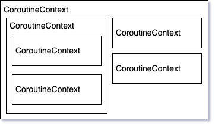

# 2. Making coroutines from blocking code

In this exercise, we will learn how to create coroutines from blocking code.

From now on, we are going to work on an application to show the weather. The UI is similar to the previous exercise. It
contains a text, a loader, and a button to request the weather. If any error occurs, it will be displayed on the UI.

Code-wise, the app's structure should be familiar:

- The data comes from two APIs:
    - `LocationApi`: to get the current location
    - `WeatherApi`: to get the weather for the location
- `WeatherRepository`: in charge of the logic to call the APIs and return the current weather
- `MainViewModel`: retrieves the weather through the repository and exposes the state for the UI
- `MainActivity`: displays the state exposed by the ViewModel

If you open `WeatherRepository`, you'll see the logic is straightforward and easy to follow:

```kotlin
fun getCurrentWeather(): Weather {
    val location = getCurrentLocation()
    val forecast = getForecast(location)
    return forecast.currentWeather
}
```

However, this function blocks the thread for a considerable amount of time, considering that it performs two network
calls. Indeed, if we were to call it from the main thread, the app would crash with a `NetworkOnMainThreadException`.
This is why `MainViewModel` spawns a thread:

```kotlin
fun onButtonClick() {
    _uiState.value = UiState.Loading

    thread {
        try {
            val weather = repository.getCurrentWeather()
            _uiState.postValue(UiState.Content(weather))
        } catch (e: Exception) {
            _uiState.postValue(UiState.Error(makeErrorMessage(e)))
        }
    }
}
```

This code too is quite easy to follow. We get the current weather from the repository and notify the UI at each step.
Also, a try-catch is all we need for handling errors.

Our job is to convert this code to coroutines, so let's apply what we learned in the previous exercise and use `launch`
instead of creating a thread:

```kotlin
fun onButtonClick() {
    _uiState.value = UiState.Loading

    MainScope().launch { // Replace thread with MainScope().launch
        try {
            val weather = repository.getCurrentWeather()
            _uiState.postValue(UiState.Content(weather))
        } catch (e: Exception) {
            _uiState.postValue(UiState.Error(makeErrorMessage(e)))
        }
    }
}
```

We run the app, tap on the button, and…

> Got an exception: NetworkOnMainThreadException

Let's see what's happening. In the previous chapters, we said that `launch` executes a new coroutine asynchronously, but
we also said that the code for every coroutine must be executed on some thread. So which thread is executing our code?
To get to the answer, we need to know that **every coroutine has an associated `CoroutineContext`** which, in our case,
is inherited from the `CoroutineScope`:

```kotlin
interface CoroutineScope {
    val coroutineContext: CoroutineContext
}
```

**We can think of `CoroutineContext` as a bag of elements** where every element is itself a `CoroutineContext`.



A context represents a set of configurations for a coroutine. One thing we can configure is the `CoroutineDispatcher`,
which will decide on which thread the coroutine runs. Common dispatchers can be accessed through the `Dispatchers`
object.

If we check what the `MainScope` function we're calling does, we see that it's using `Dispatchers.Main`, which on
Android uses the main thread.

```kotlin
fun MainScope(): CoroutineScope = ContextScope(SupervisorJob() + Dispatchers.Main)
```

All of this means that, in our ViewModel, we do launch the coroutine asynchronously, but **all of the _blocking_ code it
contains runs on the main thread**.

What we have have to do, then, is use a different dispatcher, in particular `Dispatchers.IO`, which is designed for I/O
operations. We have several ways to set it:

1\. We can override it for the whole scope, so that all coroutines started from it will be executed in background:

```kotlin
fun onButtonClick() {
    _uiState.value = UiState.Loading

    val scope = MainScope() + Dispatchers.IO // We need to import kotlinx.coroutines.plus
    scope.launch {
        …
```

However, it's not common to have to override the dispatcher for the entire scope.

2\. We can set it for a specific portion of the code, by wrapping it in `withContext`:

```kotlin
MainScope().launch {
    withContext(Dispatchers.IO) {
        try {
            …
        }
    }
}

```

This is useful when we need to set the dispatcher more than once in a coroutine or suspending function. Otherwise,
there's a more common and easy way:

3\. We can set it for the whole coroutine by passing it to `launch`:

```kotlin
fun onButtonClick() {
    _uiState.value = UiState.Loading

    MainScope().launch(Dispatchers.IO) {
        …
```

If we now run the app, everything should be working again since the content of the lambda is executed on a background
thread.

---

**Note**: we have to specify the dispatcher in this exercise because we are converting blocking code to suspending
functions. However, this usually isn't the case because suspend functions should be
[main-safe](https://developer.android.com/kotlin/coroutines/coroutines-best-practices). In practice, it means that when
we call suspending function, we should never need to change the dispatcher.

---

Here's the [full solution](../../tree/02-solution) if you want to check it. Otherwise, **let's move to the
[next exercise](../../tree/03-callbacks2coroutines).**
